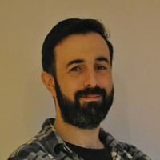

<meta name="viewport" content="width=device-width, initial-scale=1.0">

 Daniel Bretón Suárez
================================

<div align="right">
## Contact data

[d.breton.suarez@gmail.com](mailto:d.breton.suarez@gmail.com?subject=[Job opportunity])

[https://www.linkedin.com/in/dabresua/](https://www.linkedin.com/in/dabresua/)

</div>

<br>

----

>**Software engineer** with experience in IT and embedded.

----

**About me**: I am very independent, good at problem solving and I can think outside the box. I am always learning something new because I am very curious.

I focus on developing highly optimized tools and applications. I'm passionate about writing outstanding unit tests. I also have experience on managing small teams and projects. I have experience developing multi-platform applications (Linux, Windows, MacOS) and embedded.

----

## Skills

### Software
| | |
| :-- | ------: |
| I speak fluently | C, C++ |
| I can talk | Golang, Python |
| Scripting | Bash, Powershell |
| Others | Matlab/Octave, Java, Assembly |
| Code quality tools | Valgrind, GNU debugger, Cppcheck |
| DevOps Tools | Git, Gitlab, **[Github](https://github.com/dabresua)** |

### Embedded experience
| | |
| :-- | ------: |
| Architectures | 8-bit ARM, 32-bit ARM, 8-bit PIC, 8051, embedded debian |
| Low-level communications | SPI, UART, I2C |
| MCU knowhow | IRQs, low-power management, bus clocking, RTC |
| RF | RFID, Bluetooth, NB-IoT, 4G, 3G, 2G, LoRa, 868Mhz/433Mhz p2p radios |
| Hardware development | Analysis, simulations, Schematics, PCB design |
| Laboratory | Soldering, multimeter, Oscilloscope, signal debugging |

### Other experience

| | |
| :-- | ------: |
| Virtual environments | Valgrind, Virtual Box, AWS |
| Basic IT tools | Bash and PowerShell console knowhow |
| Cybersecurity | Endpoints based on **[Osquery](https://osquery.io/)** |
| Industrial devices | Aging tests, defective analysis, on-field patches |
| Manufacturing | Manufacturing instructions, integration, training |
| Smart grids | DLMS, massive deployment, massive updates |

<div style="page-break-after: always"></div>

## Profesional experience

### [**Devo**](https://www.devo.com/)

```C++
Position    = "Senior software engineer"
Location    = "Remote"
Period      = "From March 2022"
Sector      = "IT -> Cybersecurity"
Description = "Maintain and develop an endpoint agent based on Osquery. "
              "Provide engineering support to clients. "
```

### [**ZIV Automation**](https://www.zivautomation.com/)

```C++
Position    = "Embedded software engineer"
Location    = "Bilbao Area"
Period      = "From September 2018 to March 2022"
Sector      = "Industrial -> Smart Grids"
Description = "Develop embedded software for multiple smart grid projects. "
              "Develop drivers for ARM 32-bit MCU. Develop tools and scripts. "
              "Manage software teams. Implement good practices. "
              "Schedule software projects. Design architecture. "
              "Technology consultant. International project on Saudi Arabia. "
```
### [**Treelogic**](https://www.treelogic.com/en/)

```C++
Position    = "Hardware and Firmware engineer"
Location    = "Central Asturias Area"
Period      = "From April 2015 to September 2018"
Sector      = "R&D -> IT/Robotics"
Description = "Develop hardware and embedded software for multiple projects. "
              "Schedule projects. Design architecture. "
              "Technology consultant and forecasting. "
```

### [**Capgemini**](https://www.capgemini.com/?georedirect_none=true)

```C++
Position    = "Software engineer"
Location    = "Central Asturias Area"
Period      = "From October 2014 to April 2015"
Sector      = "IT -> Consultancy"
Description = "Develop software for insurance company. "
```

### [**Ikerlan**](https://www.ikerlan.es/en/)

```C++
Position    = "Power electronics researcher"
Location    = "Remote"
Period      = "From September 2013 to October 2014"
Sector      = "Industrial -> R&D"
Description = "Research new technology for DC-DC converters (equalizer)."
```

### Sound technician (multiple employers)

```C++
Position    = "Sound technician"
Location    = "Multiple"
Period      = "Multiple"
Sector      = "Shows and Events"
Description = "Live events. Sound devices maintenance."
```

<div style="page-break-after: always"></div>

## Education
### University
**Master of Science** in **telecommunications engineering** conducted at [Universidad de Oviedo](https://www.uniovi.es/en/inicio). Asturias, Spain.

* Strong focus on calculus and algebra. Including mathematical modeling and simulations.
* Electronic theory, simulations and prototyping for power electronics, control and communications.
* Software engineering foundations. OOP and embedded devices. Computational complexity, algorithms, computer science and network architecture.
* Signal theory and stochastic processes for telecommunications systems modeling.
* Strong focus on electromagnetism theory. Antenna prototyping.
* Project management, feasibility and viability analysis.
* Technical drawing and CAD basics.
* Classical physics and quantum theory basics.
* Basics on economics.

### Post-graduate education
| Subject | Company | Year |
| ------- | ------- | ---- |
| AWS Essentials | Amazon Web Services (AWS) | 2023 |
| Essential productivity skills | LifeLabs Learning | 2022 |
| Go: The Complete Developer's Guide | Stephen Grider | 2022 |
| Ansible for beginers | Mumshad Mannambeth | 2022 |
| Code quality on Python | Toronto University | 2021 |
| Remote team management | GitLab | 2021 |
| Gitlab best practices | ZIV | 2021 |
| Cybersecurity at work | ZIV | 2021 |
| Doxygen best practices | ZIV | 2021 |
| Unitary tests and continuous integration | ZIV | 2020 |
| Static code analysis tools | ZIV | 2020 |
| GNU Autotools | ZIV | 2019 |
| Introduction to PRIME | ZIV | 2019 |
| First Aids | Tecnalia | 2019 |
| Code style | Tecnalia | 2019 |
| Electrical risks and security | Tecnalia | 2019 |
| Introduction to A.I | Stanford University | 2019 |

### Languages
* **Spanish**: Native
* **English**: Writing and listening C1, speaking B2.

<div style="page-break-after: always"></div>

## Awards
### 2015 Third Prize Paper Award.

The Transportation Systems Committee of the IEEE Industry Applications Society.

For the manuscript co-authored with M. Arias, M.M. Hernando, U. Viscarret and Iñigo Gil, entitled "Equalization system for serially-connected battery cells based on the wave-trap concept" as presented at the 2014 Energy conversion Congress and Exposition, Pittsburgh, PA, USA.

### Codingame

| | |
| ----- | ----- |
| [**C language certification**](https://www.codingame.com/certification/eSfDFqIQU9tl14dGjPRGAg) | [**C++ language certification**](https://www.codingame.com/certification/1BuYfr1KIcPI7FwwGa0H7g) |
| {width=75%} | {width=75%} |


## Interests

Music, hiking, running, science, homebrew beer, culture, gastronomy

## Other links of Interest

| | |
| :---- | ----: |
| [](https://www.linkedin.com/in/dabresua/) | [https://www.linkedin.com/in/dabresua/](https://www.linkedin.com/in/dabresua/) |
| [](https://dbsportfolio.wordpress.com/) | [https://dbsportfolio.wordpress.com/](https://dbsportfolio.wordpress.com/) |
| [](https://bit.ly/3xL5Evp) | [https://bit.ly/3xL5Evp](https://bit.ly/3xL5Evp) |
| [](https://github.com/dabresua) | [https://github.com/dabresua](https://github.com/dabresua) |
| [](https://www.codewars.com/users/dabresua) | [https://www.codewars.com/users/dabresua](https://www.codewars.com/users/dabresua) |
| [](https://www.hackerrank.com/d_breton_suarez) | [https://www.hackerrank.com/d_breton_suarez](https://www.hackerrank.com/d_breton_suarez) |

<br>

---

Last modification: 03/03/2023

This document is public and is hosted at:

* html responsive: [https://dabresua.github.io/](https://dabresua.github.io/)
* pdf: [https://github.com/dabresua/dabresua.github.io/raw/master/DBS_CV_remote.pdf](https://github.com/dabresua/dabresua.github.io/raw/master/DBS_CV_remote.pdf)

This document has been generated using markdown and pandoc, source code is available at [https://github.com/dabresua/dabresua.github.io](https://github.com/dabresua/dabresua.github.io)
